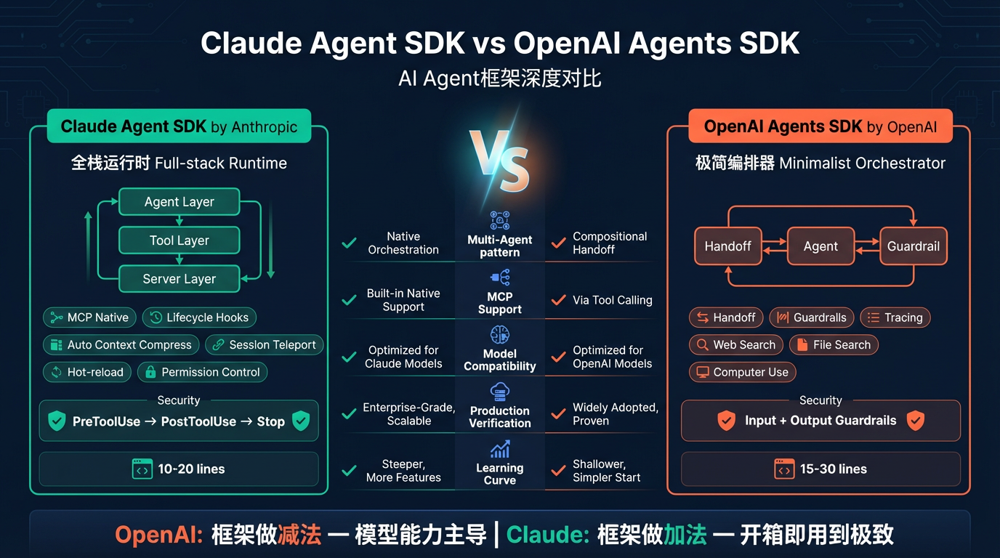

2025年是AI Agent框架爆发的一年。OpenAI在3月推出了Agents SDK（Python版），6月迅速跟进了TypeScript版本；Anthropic则以Claude Agent SDK强势回应。两大框架代表了截然不同的智能体开发哲学——一个追求轻量极简的多Agent编排，另一个则打造深度集成的全栈Agent运行时。本文将从架构理念、核心能力、开发体验和生产就绪性等维度，对两大SDK进行全面深度对比。

<!--more-->



## 背景：智能体框架的军备竞赛

在2024-2025年间，AI Agent从"概念验证"迈入"生产落地"阶段。开发者面临一个关键选择：用什么框架来构建自己的智能体系统？

市场上主流选择包括LangChain、AutoGPT、LlamaIndex等。但真正引发行业关注的，是两大模型厂商亲自下场推出的官方框架：

- **OpenAI Agents SDK**（2025年3月Python版，6月TypeScript版）：基于实验性框架Swarm演进而来，定位为轻量级多Agent编排工具，目前已覆盖Python和JavaScript/TypeScript双生态
- **Claude Agent SDK**（Anthropic推出）：将Claude Code的底层架构开放为可编程接口，定位为企业级Agent运行时系统

两者的设计哲学和技术路线存在显著差异，理解这些差异对于技术选型至关重要。

## 设计哲学对比

### OpenAI Agents SDK：极简主义的编排器

OpenAI Agents SDK延续了Swarm框架的设计理念——**用最少的抽象完成最多的事**。核心只有三个概念：

```
Agent（智能体）+ Handoff（交接）+ Guardrail（护栏）
```

它的设计哲学是：**框架负责编排，模型负责智能**。框架本身尽可能薄，把复杂度留给LLM自身的能力。

### Claude Agent SDK：全栈式的运行时

Claude Agent SDK的设计哲学完全不同——**给Agent一台完整的"电脑"**。它不仅仅是一个编排器，而是一个包含工具执行、权限控制、上下文管理、会话持久化的完整运行时系统。

核心架构采用"代理-工具-服务器"三层模型：

```
代理层（Agent Layer）—— 决策引擎 + 上下文管理 + 流程控制
        ↓
工具层（Tool Layer）—— 文件读写 + Bash执行 + 自定义工具
        ↓
服务器层（Server Layer）—— MCP服务器管理 + 工具集成 + 通信协议
```

一个比喻：如果OpenAI Agents SDK是"交通指挥中心"（负责调度车辆），Claude Agent SDK就是"整个城市的基础设施"（包含道路、信号灯、停车场等一切）。

## 核心概念对比

### Agent定义

**OpenAI Agents SDK** 的Agent定义简洁明了，且Python和TypeScript两个版本保持了高度一致的API设计：

```python
# Python 版本
from agents import Agent, Runner

agent = Agent(
    name="Assistant",
    instructions="你是一名助人为乐的助手。",
    model="gpt-4o",
    tools=[get_weather],
)

result = await Runner.run(agent, "今天北京天气如何？")
print(result.final_output)
```

```typescript
// TypeScript 版本（@openai/agents）
import { Agent, run } from '@openai/agents';

const agent = new Agent({
  name: 'Assistant',
  instructions: '你是一名助人为乐的助手。',
  tools: [getWeatherTool],
});

const result = await run(agent, '今天北京天气如何？');
console.log(result.finalOutput);
```

Agent由`instructions`（指令）、`model`（模型）、`tools`（工具）三要素构成，通过`Runner`/`run`来驱动执行。设计上追求**声明式和直觉化**，两个语言版本的心智模型完全一致。

**Claude Agent SDK** 提供两种交互模式：

```python
# 模式一：简单查询（高级接口）
import asyncio
from claude_agent_sdk import query

async def main():
    async for message in query("分析这段代码的性能瓶颈"):
        print(message)

asyncio.run(main())
```

```python
# 模式二：完整客户端（低级接口）
from claude_agent_sdk import ClaudeSDKClient, ClaudeAgentOptions

options = ClaudeAgentOptions(
    system_prompt="你是一个资深Python开发者。",
    permission_mode="accept_edits",
    read_write_tools=True,
    bash_tools=True,
    cwd="/path/to/project",
    max_cost=1.0,
)

client = ClaudeSDKClient(options=options)
# 支持双向交互式对话...
```

Claude SDK的Agent天生具备**文件读写、Bash命令执行**等能力，不需要额外定义。这是因为它本质上是把Claude Code的完整能力API化了。

### 多Agent协作

**OpenAI Agents SDK** 通过Handoff机制实现多Agent协作，这是其最具特色的设计：

```python
# 创建专业Agent
chinese_agent = Agent(
    name="中文客服",
    instructions="你只能用中文回复。",
    handoff_description="当用户使用中文时，交给该Agent。",
)

english_agent = Agent(
    name="English Support",
    instructions="You can only respond in English.",
    handoff_description="When user speaks English, hand off to this agent.",
)

# 分诊Agent负责路由
triage_agent = Agent(
    name="分诊Agent",
    instructions="根据用户语言将请求路由到合适的Agent。",
    handoffs=[chinese_agent, english_agent],
)

result = await Runner.run(triage_agent, "Hello, how are you?")
```

Handoff的底层实现与Function Calling相同，Agent之间的切换对LLM来说就像调用一个工具。这种设计非常优雅，使得多Agent编排可以用**声明式**的方式完成。

**Claude Agent SDK** 的多Agent策略不同，它采用**自定义代理与自动委派**：

```markdown
# 定义专家代理配置文件
name: Security Reviewer
description: Reviews code for security vulnerabilities
tools: [semgrep, codeql]
model: claude-sonnet-4-5
```

Claude SDK的Sub-Agent拥有独立的上下文窗口，主Agent可以自动检测任务类型并委派给合适的子Agent。这更像是"指挥官-执行者"模式，而非OpenAI的"接力赛"模式。

### 工具系统

这是两个框架差异最大的部分。

**OpenAI Agents SDK** 的工具体系分为三层：

| 层级 | 类型 | 示例 |
|------|------|------|
| 托管工具 | OpenAI原生提供 | Web Search、File Search、Computer Use |
| 函数工具 | 函数自动转换为工具 | Python `@function_tool` / TypeScript `tool()` |
| MCP工具 | 外部MCP服务器 | 2025年3月27日起支持 |

Python和TypeScript版本在工具定义上风格一致，但各自利用了语言原生特性：

```python
# Python — 装饰器 + 类型注解自动生成Schema
from agents import function_tool

@function_tool
def get_weather(city: str):
    """查询指定城市的天气信息"""
    return {"temp": 22, "condition": "晴"}
```

```typescript
// TypeScript — tool() + Zod Schema 定义参数
import { z } from 'zod';
import { tool } from '@openai/agents';

const getWeatherTool = tool({
  name: 'get_weather',
  description: '查询指定城市的天气信息',
  parameters: z.object({ city: z.string() }),
  execute: async (input) => {
    return `The weather in ${input.city} is sunny`;
  },
});
```

Python版通过`@function_tool`装饰器自动从类型注解生成JSON Schema；TypeScript版则借助`Zod`库进行Schema验证，两者开发体验都非常丝滑。

**Claude Agent SDK** 的工具体系围绕MCP协议构建：

```python
from claude_agent_sdk import Tool, create_sdk_mcp_server

# @tool装饰器定义工具
greet_tool = Tool(
    name="greet",
    description="Greet a user by name.",
    inputSchema={
        "type": "object",
        "properties": {
            "name": {"type": "string", "description": "User's name"}
        },
        "required": ["name"]
    }
)

async def greet(name: str) -> str:
    return f"Hello, {name}!"

# 打包为In-Process MCP服务器
mcp_server = create_sdk_mcp_server(
    name="my_tools",
    version="1.0.0",
    tools=[greet_tool],
    tool_handlers={"greet": greet}
)
```

Claude SDK的核心创新是**In-Process MCP Server**——工具运行在与应用相同的Python进程中，无需子进程管理，避免了IPC开销。同时，它天然兼容外部MCP服务器生态（500+服务），包括GitHub、Slack、PostgreSQL、Notion等。

## 关键能力维度对比

### 安全与防护

**OpenAI Agents SDK — Guardrails（护栏）**

Guardrails分为输入防护和输出防护两层：

```python
from agents import guardrail

@guardrail
def check_topic(input_text: str) -> bool:
    """检查输入是否偏离主题"""
    # 如果偏离主题返回False，触发拦截
    ...
```

- **输入护栏**：检测输入是否偏离主题，可接管Agent控制权
- **输出护栏**：在Agent最终输出上运行合规检查
- **并行运行**：护栏与Agent操作并行执行，不阻塞主流程

设计思路是**声明式的边界检查**。

**Claude Agent SDK — 生命周期钩子 + 细粒度权限**

Claude SDK的安全体系更为纵深：

```python
@agent.hook("PreToolUse")
async def validate_tool(tool_name, params):
    """工具执行前拦截危险操作"""
    if tool_name == "delete_file" and "/system" in params["path"]:
        return {"action": "reject", "reason": "Protected path"}
    return {"action": "approve"}

@agent.hook("PostToolUse")
async def log_result(tool_name, result):
    """工具执行后审计记录"""
    await log_to_datadog(tool_name, result)

@agent.hook("Stop")
async def cleanup():
    """会话结束时资源释放"""
    await close_database_connections()
```

三层钩子（PreToolUse → PostToolUse → Stop）提供了完整的**AOP（面向切面）风格**的控制能力。配合权限模式（`accept_all`/`accept_edits`/`prompt`），可以精确控制Agent能做什么、不能做什么。

### 可观测性

**OpenAI Agents SDK — Tracing**

内置追踪系统，记录Agent运行全过程：

- LLM生成、工具调用、Handoff、Guardrail事件
- 支持外部监测工具集成（Logfire、AgentOps、Braintrust等）
- 支持可视化调试、性能评估、模型微调

这是OpenAI SDK的一大亮点——**开箱即用的生产级可观测性**。

**Claude Agent SDK — 流式会话 + 审计日志**

```python
# 流式数据以JSONL格式存储，记录AI思考的每一个瞬间
options = ClaudeAgentOptions(
    log_level="INFO",
    audit_log_path="/var/log/claude_agent.log"
)
```

Claude SDK通过流式会话（Streaming Sessions）实时展现AI工作过程，配合完整的审计日志追踪所有工具调用。

### 上下文管理

| 能力 | OpenAI Agents SDK | Claude Agent SDK |
|------|-------------------|------------------|
| 上下文压缩 | 依赖模型自身能力 | 自动上下文压缩，保留关键信息 |
| Token管理 | 手动管理 | 自动管理，无需人工干预 |
| 工具上下文优化 | 一次性加载所有工具描述 | MCP Tool Search动态加载（从77K降至8.7K tokens） |
| 会话持久化 | 通过`to_input_list()`拼接 | 原生支持会话传送和热重载 |

Claude SDK在上下文管理上的**MCP Tool Search**尤其值得关注——当接入多个MCP服务器时，它不会一次性加载所有工具描述（避免上下文污染），而是根据当前任务动态检索和加载，可减少85%的上下文开销。

### 模型兼容性

| 维度 | OpenAI Agents SDK | Claude Agent SDK |
|------|-------------------|------------------|
| 默认模型 | GPT-4o、o3-mini等OpenAI系列 | Claude Opus 4、Sonnet 4等 |
| 第三方模型 | 支持所有兼容Chat Completions API的模型 | 主要面向Claude模型生态 |
| 模型路由 | 需手动指定模型 | 自动根据任务复杂度切换模型（成本降低50%） |

OpenAI SDK在模型兼容性上更开放，官方明确支持接入Anthropic、Google等第三方模型。Claude SDK则深度绑定Claude生态，但提供了智能模型路由——简单任务用便宜模型、复杂任务用强力模型。

## 开发体验对比

### 学习曲线与代码量

```python
# OpenAI Agents SDK (Python) — Hello World（4行代码）
from agents import Agent, Runner

agent = Agent(name="Greeter", instructions="Say hello!")
result = Runner.run_sync(agent, "Hi!")
print(result.final_output)
```

```typescript
// OpenAI Agents SDK (TypeScript) — Hello World（同样简洁）
import { Agent, run } from '@openai/agents';

const agent = new Agent({ name: 'Greeter', instructions: 'Say hello!' });
const result = await run(agent, 'Hi!');
console.log(result.finalOutput);
```

```python
# Claude Agent SDK — Hello World（5行代码）
import asyncio
from claude_agent_sdk import query

async def main():
    async for message in query("Hello!"):
        print(message)

asyncio.run(main())
```

三者的入门门槛都很低。但随着复杂度提升，差异逐渐显现：

| 场景 | OpenAI SDK代码量 | Claude SDK代码量 |
|------|-----------------|-----------------|
| 简单问答 | 4行 | 5行 |
| 带工具的Agent | 15-30行 | 10-20行 |
| 多Agent协作 | 30-60行 | 20-40行 |
| 企业级应用 | 100+行 + 大量自定义逻辑 | 50-80行（内置能力更多） |

Claude SDK在复杂场景下代码量更少，因为文件操作、Bash执行、权限控制等能力是内置的。OpenAI SDK需要自行实现这些基础设施。

### 语言与生态

| 维度 | OpenAI Agents SDK | Claude Agent SDK |
|------|-------------------|------------------|
| 语言支持 | **Python + TypeScript**（双语言已发布） | Python + TypeScript |
| 包管理（Python） | `pip install openai-agents` | `pip install claude-agent-sdk` |
| 包管理（TypeScript） | `npm install @openai/agents zod` | `npm install @anthropic-ai/claude-agent-sdk` |
| TypeScript运行环境 | Node.js 22+、Deno、Bun（实验性支持Cloudflare Workers） | Node.js 18+ |
| Schema验证 | Zod v4 | JSON Schema |
| 开源状态 | 完全开源 | SDK开源 |
| GitHub Stars | Python版开源2天近5K Stars；TypeScript版（openai-agents-js）2.3K+ Stars | 生态快速增长 |
| 浏览器支持 | ✅ TypeScript版提供浏览器优化包 | ❌ 仅服务端 |
| 实时语音 | ✅ `@openai/agents-realtime` 包（RealtimeAgent） | ❌ 无原生支持 |

> **更新说明**：OpenAI于2025年6月3日正式发布了Agents SDK的TypeScript版本（`@openai/agents`），与Python版**功能完全对齐**，包含Handoffs、Guardrails和Tracing等全部核心组件。同时还新增了**RealtimeAgent**语音能力和**人机回路（HITL）审批机制**，这是Claude Agent SDK目前不具备的差异化特性。

## 全维度对比总览

| 维度 | OpenAI Agents SDK | Claude Agent SDK |
|------|-------------------|------------------|
| **发布时间** | 2025年3月（Python）/ 6月（TypeScript） | 2025年 |
| **定位** | 轻量级多Agent编排框架 | 企业级Agent运行时系统 |
| **前身** | Swarm（实验性框架） | Claude Code底层架构 |
| **核心概念** | Agent + Handoff + Guardrail | Agent + Tool + MCP Server + Hooks |
| **设计哲学** | 极简抽象、多语言并行 | 全栈运行时、深度集成 |
| **内置工具** | Web Search、File Search、Computer Use | 文件读写、Bash执行、代码导航 |
| **多Agent模式** | Handoff（接力式交接） | Sub-Agent（指挥官-执行者） |
| **安全机制** | Guardrails（输入/输出护栏） | 生命周期钩子 + 细粒度权限 |
| **可观测性** | 内置Tracing系统 | 流式会话 + 审计日志 |
| **上下文管理** | 手动管理 | 自动压缩 + 动态工具搜索 |
| **MCP支持** | 2025年3月27日起支持 | 原生深度集成 |
| **模型兼容** | 开放兼容第三方模型 | 深度绑定Claude生态 |
| **生产验证** | 生产就绪 | 驱动Claude Code（十亿美元级产品） |
| **学习曲线** | 低 | 低（简单场景）/ 中（高级特性） |
| **语言支持** | Python + TypeScript（双版本功能对齐） | Python + TypeScript |
| **独特优势** | Handoff编排直觉优雅、RealtimeAgent语音、浏览器端运行 | 会话传送、技能热重载、自动模型路由 |

## 如何选择？

### 选OpenAI Agents SDK的场景

- **多Agent路由和编排**是核心需求（Handoff机制设计非常优雅）
- 需要**跨模型兼容性**（已经在用非OpenAI模型或需要灵活切换）
- 团队偏好**极简框架**，愿意自行搭建基础设施
- 需要**内置Tracing**进行生产级可观测性
- 项目中已经大量使用OpenAI API生态
- 需要**前后端统一技术栈**（TypeScript版支持浏览器端运行）
- 有**实时语音Agent**需求（RealtimeAgent + HITL审批）

### 选Claude Agent SDK的场景

- 需要Agent具备**原生代码执行和文件操作能力**
- 需要**细粒度的安全控制**（生命周期钩子、权限模式）
- 对**MCP生态集成**有深度需求（500+服务）
- 需要**上下文自动管理**（压缩、动态工具加载）
- 构建**长时间运行的复杂Agent**（会话传送、热重载）
- 项目依赖Claude模型能力，特别是代码生成和推理场景

### 不必二选一

值得注意的是，两个SDK并非完全互斥。在实际项目中，完全可以：

- 用OpenAI SDK做上层多Agent编排和路由
- 在某些需要深度文件操作的子任务中，调用Claude SDK
- 通过MCP协议，让两个生态的工具互相复用

## 结语

OpenAI Agents SDK和Claude Agent SDK代表了两种不同的智能体开发范式：

- **OpenAI路线**：框架做减法，让模型能力主导，开发者自由度最大化。Python和TypeScript双版本齐头并进，还独占RealtimeAgent语音能力和浏览器端运行
- **Claude路线**：框架做加法，内置完整基础设施，开箱即用到极致。在上下文管理、安全控制和会话持久化上建立了深厚的护城河

没有绝对的优劣，只有是否匹配你的需求。对于追求快速原型和灵活编排的团队，OpenAI SDK是更好的起点；对于构建生产级、需要深度控制和安全保障的企业级Agent，Claude SDK提供了更成熟的基础设施。

无论选择哪个，2025-2026年无疑是AI Agent开发者最好的时代——工具已经成熟，模式已被验证，剩下的只是去构建真正有价值的智能体应用。
