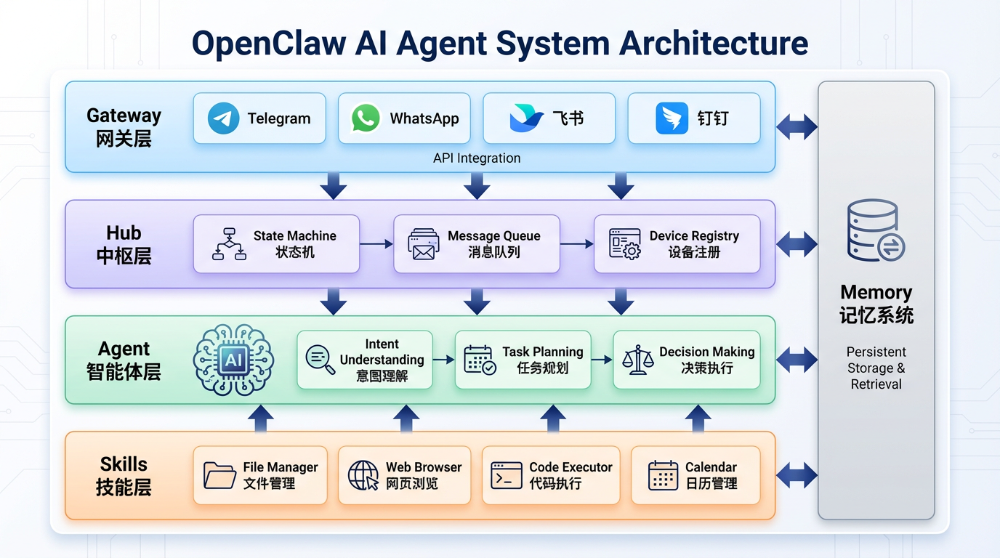
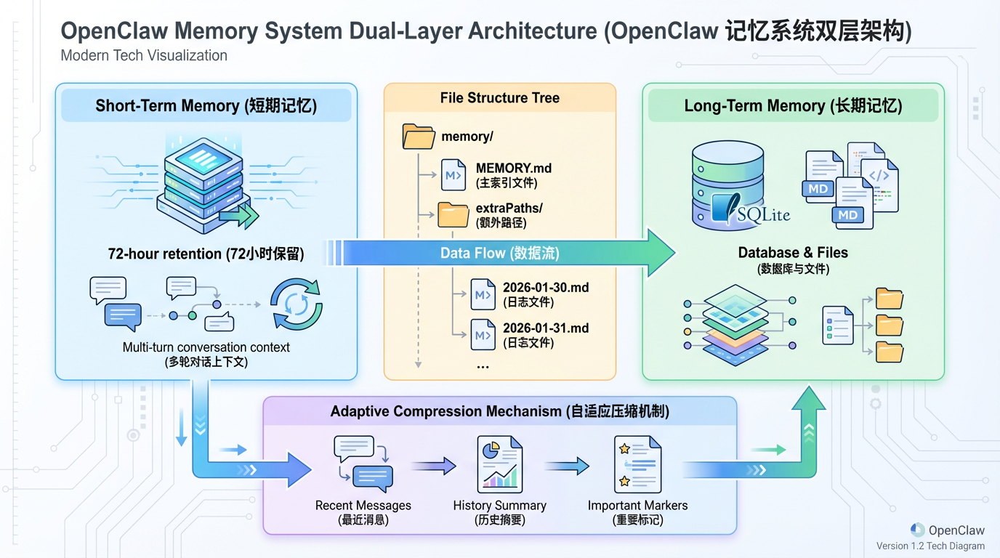

2026年1月，一个名为OpenClaw（原名Clawdbot/Moltbot）的开源项目横空出世，在GitHub上以惊人的速度收获超过12万星标，一度带火了Mac Mini的销量。阿里云、腾讯云火速接入，推出一键部署方案。

这个项目为何能引发如此轰动？因为它真正实现了从"对话式AI"到"代理式AI"的跨越——**不再只是回答问题，而是能够真正"替你干活"**。

今天，我们就以OpenClaw为案例，拆解一个成熟AI智能体的核心架构设计，帮助开发者理解如何构建自己的"数字员工"。

<!--more-->



## 一、OpenClaw是什么？为什么它能火

在深入架构之前，先简单介绍一下OpenClaw的定位：

**OpenClaw是一个本地运行的AI智能体框架**，它具备以下核心能力：

- **24小时自主工作**：可以在你的电脑上持续运行，随时待命
- **多端交互**：通过Telegram、WhatsApp、飞书等聊天工具接收指令
- **本地数据主权**：文件和日志完全留存在用户本地，满足隐私需求
- **持久记忆**：能够记住所有对话历史和用户偏好
- **可扩展技能**：支持自定义Skills，能力边界可无限拓展

**打个比方**：如果说ChatGPT是一个"博学的顾问"，那OpenClaw就是一个"能动手的助理"。你可以让它整理会议纪要、同步跨平台日程、比价下单并生成报销凭证，甚至在检测到你连续加班时，自动预约按摩师上门。

这种"代理执行"能力，正是AI从"工具"进化为"员工"的关键跨越。

---

## 二、OpenClaw的四层架构设计

OpenClaw采用了清晰的分层设计，主要由**四个核心组件**构成：

| 层级 | 组件名称 | 核心职责 |
|-----|---------|---------|
| 接入层 | **Gateway（网关）** | 统一接入多渠道消息，协调消息路由 |
| 调度层 | **Hub（中枢）** | 维护状态机和消息队列，作为唯一事实来源 |
| 智能层 | **Agent（智能体）** | 任务理解、规划拆解、决策执行 |
| 执行层 | **Skills（技能）** | 具体工具调用，完成实际操作 |

此外，还有一个贯穿全局的**Memory（记忆系统）**，为整个系统提供上下文支持。

### 2.1 Gateway：消息网关——系统的"前台接待"

Gateway是整个系统的统一入口，运行在本地端口`ws://127.0.0.1:18789`，负责：

1. **多渠道消息接入**：对接Telegram、WhatsApp、飞书、钉钉等多个平台
2. **消息格式标准化**：将不同平台的消息转换为统一的内部格式
3. **路由分发**：将消息分发到对应的处理模块
4. **结果回传**：将处理结果通过原路径返回给用户

**技术实现要点**：

```javascript
// Gateway基于WebSocket建立全双工通信
const gateway = new WebSocketServer({ port: 18789 });

gateway.on('connection', (client) => {
  // 设备配对与授权
  client.on('message', (message) => {
    const standardMsg = normalizeMessage(message); // 消息标准化
    routeToHub(standardMsg); // 路由到中枢
  });
});
```

**设计启示**：Gateway的核心价值在于**解耦**。无论用户从哪个平台发起请求，对后端的Agent来说都是透明的。这种设计让系统可以轻松扩展新的接入渠道，而无需修改核心逻辑。

### 2.2 Hub：中枢——系统的"大脑指挥部"

Hub是整个架构的核心控制面，运行在用户的核心计算设备上，作为**唯一事实来源（Single Source of Truth）**。它负责：

1. **状态管理**：维护所有活跃对话的状态机
2. **消息队列**：管理待处理任务的优先级队列
3. **设备注册**：维护客户端节点注册表
4. **动态路由**：根据节点能力声明，精准分发命令

**能力声明机制**是Hub的一个亮点设计：

```javascript
// 每个客户端节点可主动声明自身能力
const nodeCapabilities = {
  nodeId: 'mac-mini-001',
  capabilities: ['camera', 'notification', 'file-system', 'browser'],
  status: 'online'
};

// Hub维护动态路由表
const routingTable = new Map();
routingTable.set('camera', 'mac-mini-001');
routingTable.set('notification', ['mac-mini-001', 'iphone-001']);
```

**设计启示**：Hub的设计体现了**集中式控制与分布式执行**的平衡。状态和决策集中管理，但具体执行分散到各个节点，既保证了一致性，又具备了扩展性。

### 2.3 Agent：智能体——系统的"大脑"

Agent是整个系统的智能核心，负责理解用户意图、规划任务、做出决策。OpenClaw的Agent设计有几个值得学习的特点：

#### （1）智能体事件循环（Agent Loop）

Agent的核心是一个可观测的事件循环，将**消息上下文 → 工具调用 → 回复动作 → 状态持久化**转化为一个闭环流程：

```python
class AgentLoop:
    def run(self, user_message):
        # 1. 获取上下文
        context = self.memory.get_context(user_message)
        
        # 2. LLM推理，生成行动计划
        plan = self.llm.plan(user_message, context)
        
        # 3. 执行计划中的每个步骤
        for step in plan.steps:
            if step.type == 'tool_call':
                result = self.skills.execute(step.tool, step.params)
                self.memory.store(step, result)  # 持久化
            elif step.type == 'response':
                return step.content
        
        # 4. 反思与优化（可选）
        self.reflect(plan, results)
```

#### （2）思考层级路由（Thinking Level）

OpenClaw支持按需调用不同能力的模型：

- **闲聊场景**：使用轻量级模型（如Claude Haiku），响应快、成本低
- **复杂编程**：使用大模型（如Claude Opus），能力强、推理深
- **深度思考**：启用"ultrathink"模式，进行多步推理

```python
def select_model(task_complexity):
    if task_complexity == 'casual':
        return 'claude-haiku'
    elif task_complexity == 'coding':
        return 'claude-sonnet'
    elif task_complexity == 'deep_reasoning':
        return 'claude-opus-ultrathink'
```

**设计启示**：Agent的核心不是"调用一次LLM"，而是**构建一个可观测、可控制、可优化的推理循环**。思考层级路由则体现了成本与能力的精细化平衡。

### 2.4 Skills：技能系统——系统的"手脚"

Skills是Agent调用的具体工具集合，是AI智能体"能干活"的关键。OpenClaw的Skills系统设计遵循MCP协议（Model Context Protocol），具备以下特点：

#### （1）标准化接口

每个Skill都遵循统一的接口规范：

```python
class BaseSkill:
    name: str           # 技能名称
    description: str    # 技能描述（供LLM理解）
    parameters: dict    # 参数定义（JSON Schema）
    
    def execute(self, params: dict) -> dict:
        """执行技能，返回结果"""
        raise NotImplementedError
```

#### （2）常见Skills示例

| Skill名称 | 功能描述 | 调用场景 |
|-----------|---------|---------|
| `file_manager` | 文件读写、整理、搜索 | "帮我整理下载文件夹" |
| `web_browser` | 网页浏览、信息提取 | "查一下明天的天气" |
| `code_executor` | 代码执行、脚本运行 | "运行这个Python脚本" |
| `calendar` | 日程管理、提醒设置 | "下周三下午安排会议" |
| `email` | 邮件读取、发送、分类 | "帮我回复这封工作邮件" |
| `notification` | 系统通知推送 | "10分钟后提醒我开会" |

#### （3）MCP协议集成

OpenClaw通过MCP协议实现工具的"即插即用"：

```javascript
// 注册MCP Server
const mcpServer = {
  name: 'file-manager',
  version: '1.0.0',
  tools: [
    {
      name: 'read_file',
      description: '读取指定路径的文件内容',
      inputSchema: {
        type: 'object',
        properties: {
          path: { type: 'string', description: '文件路径' }
        },
        required: ['path']
      }
    }
  ]
};
```

**设计启示**：Skills系统的关键在于**标准化**和**可扩展**。通过遵循MCP协议，开发者可以轻松添加新的技能，而无需修改Agent的核心逻辑。

---

## 三、记忆系统：让AI拥有"长期记忆"

记忆系统是OpenClaw区别于普通聊天机器人的关键特性。它让AI能够记住用户的偏好、历史对话，从而提供更个性化、更连贯的服务。



### 3.1 双层记忆架构

OpenClaw采用**短期记忆 + 长期记忆**的双层架构：

| 记忆类型 | 存储介质 | 保留时间 | 用途 |
|---------|---------|---------|-----|
| **短期记忆** | 内存缓存 | 72小时 | 保持多轮对话连贯性 |
| **长期记忆** | SQLite + Markdown | 永久 | 存储用户偏好、历史决策 |

### 3.2 长期记忆的文件结构

长期记忆通过结构化的文件系统实现持久化：

```
memory/
├── MEMORY.md           # 核心记忆文件：用户偏好、重要决策
├── 2026-01-30.md       # 日期分片：当天的对话笔记
├── 2026-01-31.md       
├── 2026-02-01.md       
└── extraPaths/         # 外部文档索引
    ├── work_projects.md
    └── personal_notes.md
```

**MEMORY.md示例**：

```markdown
# 用户偏好

## 工作习惯
- 喜欢在早上9点前处理邮件
- 会议纪要偏好Markdown格式
- 代码风格：使用2空格缩进

## 个人偏好
- 不喜欢红眼航班
- 咖啡偏好：美式，少糖
- 常用外卖平台：美团

## 重要联系人
- 老板：张总，邮箱 zhang@company.com
- 助理：小李，飞书ID lixiao
```

### 3.3 自适应上下文压缩

当对话历史过长时，OpenClaw会进行智能压缩：

```python
class AdaptiveCompaction:
    def compress_context(self, messages, max_tokens=8000):
        if self.count_tokens(messages) <= max_tokens:
            return messages
        
        # 策略1：保留最近的消息
        recent = messages[-20:]
        
        # 策略2：提取历史摘要
        summary = self.llm.summarize(messages[:-20])
        
        # 策略3：保留标记为重要的消息
        important = [m for m in messages if m.get('important')]
        
        return [{'role': 'system', 'content': summary}] + important + recent
```

**设计启示**：记忆系统的核心不在于"记住所有内容"，而在于**记住正确的内容**。通过分层存储和智能压缩，在有限的上下文窗口内最大化信息价值。

---

## 四、任务执行流程：一个完整的例子

理解了各个组件后，让我们通过一个完整的例子，看看OpenClaw是如何处理一个用户请求的。

**场景**：用户通过Telegram发送消息——"帮我整理下载文件夹，把图片按月份分类"

### 执行流程：

```
1. [用户] 通过Telegram发送指令
          ↓
2. [Gateway] 接收消息，转换为标准格式
   {
     "channel": "telegram",
     "user_id": "12345",
     "content": "帮我整理下载文件夹，把图片按月份分类",
     "timestamp": "2026-02-06T10:30:00Z"
   }
          ↓
3. [Hub] 分配任务，检索用户上下文
   - 查询Memory：用户的下载文件夹路径是/Users/xxx/Downloads
   - 查询能力路由：file_manager技能可用
          ↓
4. [Agent] 理解意图，制定计划
   Plan: [
     Step1: 调用file_manager.list_files(path="/Users/xxx/Downloads", filter="*.jpg,*.png"),
     Step2: 调用file_manager.get_file_date(files),
     Step3: 调用file_manager.create_folders(pattern="YYYY-MM"),
     Step4: 调用file_manager.move_files(files, target_folders),
     Step5: 生成整理报告
   ]
          ↓
5. [Skills] 依次执行每个步骤
   - file_manager执行文件操作
   - 返回执行结果
          ↓
6. [Agent] 整合结果，生成回复
   "已完成整理！共处理128张图片，分别归类到以下文件夹：
    - 2026-01/：45张
    - 2026-02/：38张
    - 2025-12/：45张"
          ↓
7. [Memory] 持久化本次交互
   - 短期记忆：记录本次对话
   - 长期记忆：记录"用户喜欢按月份整理图片"
          ↓
8. [Gateway] 通过Telegram返回结果给用户
```

---

## 五、设计你自己的AI智能体：关键启示

通过对OpenClaw架构的分析，我们可以提炼出设计AI智能体的几个关键原则：

### 5.1 分层解耦，各司其职

```
┌─────────────────────────────────────────────────────┐
│                    用户接入层                        │
│         (Telegram / WhatsApp / 飞书 / Web)           │
└─────────────────────┬───────────────────────────────┘
                      ↓
┌─────────────────────────────────────────────────────┐
│                   消息网关层                         │
│            (协议转换 / 路由分发 / 鉴权)              │
└─────────────────────┬───────────────────────────────┘
                      ↓
┌─────────────────────────────────────────────────────┐
│                   智能体核心层                       │
│          (意图理解 / 任务规划 / 决策执行)            │
└─────────────────────┬───────────────────────────────┘
                      ↓
┌─────────────────────────────────────────────────────┐
│                   技能执行层                         │
│           (文件 / 浏览器 / 代码 / 通知)              │
└─────────────────────────────────────────────────────┘
                      ↕
┌─────────────────────────────────────────────────────┐
│                   持久化记忆层                       │
│            (短期缓存 / 长期存储 / 向量索引)          │
└─────────────────────────────────────────────────────┘
```

### 5.2 标准化协议，可扩展生态

- 采用**MCP协议**实现工具标准化，让新技能可以"即插即用"
- 采用**A2A协议**实现多智能体协作，让不同Agent可以互相调用

### 5.3 本地优先，隐私可控

- 核心数据存储在用户本地
- 远程访问通过Tailscale等私有网络工具
- LLM推理可选择本地模型或云端API

### 5.4 持久记忆，个性化服务

- 双层记忆架构（短期 + 长期）
- 结构化存储（Markdown + SQLite）
- 自适应压缩，最大化上下文价值

### 5.5 成本感知，按需调用

- 思考层级路由，简单任务用轻量模型
- Token计数与预算控制
- 缓存复用，减少重复调用

---

## 六、总结：从OpenClaw看AI Agent的未来

OpenClaw的爆火不是偶然。它代表了AI发展的一个重要方向：**从被动应答走向主动执行，从对话工具进化为数字员工**。

如果说2025年是"AI Agent概念验证年"，那么2026年正在成为**"AI Agent规模化落地元年"**。谷歌的报告显示，52%的生成式AI应用企业已将智能体投入生产，88%的AI Agent采用者已获得正投资回报率。

对于开发者而言，理解OpenClaw的架构设计，不仅能帮助你使用这个工具，更能让你具备设计和构建自己的AI智能体系统的能力。

**未来，每个人都可能拥有自己的AI助手。而那些能够设计和定制这些助手的人，将在AI时代占据先机。**

---

## 参考资源

- [OpenClaw GitHub仓库](https://github.com/pspdfkit/openclaw)
- [MCP协议官方文档](https://modelcontextprotocol.io/)
- [A2A协议规范](https://www.a2aprotocol.net/)
- [谷歌2026年AI Agent趋势报告](https://cloud.google.com/ai-agent-report-2026)
