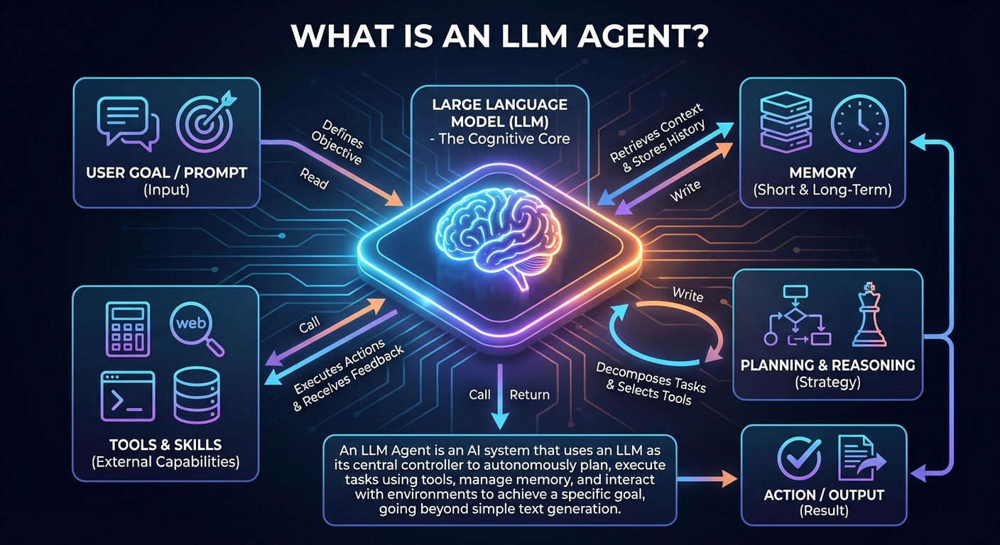

在人工智能的浪潮中，我们经常听到 LLM（大语言模型，如 GPT、DeepSeek）这个词。如果把 LLM 比作一个博学但瘫痪在床的“超级大脑”，那么 **AI Agent（AI 智能体）** 就是给这个大脑装上了手脚、感官和记忆，让它不仅能“陪你聊天”，还能真正地“帮你干活”。

结合这张架构图，我们来深入剖析一下：**到底什么是 AI Agent？它又是如何工作的？**

<!--more-->

### 核心定义：不仅仅是生成文本

正如图片底部所定义的：
> **AI Agent 是一个以大语言模型（LLM）为中央控制器，能够自主规划、使用工具、管理记忆并与环境交互，从而实现特定目标的 AI 系统。**

简单来说，**ChatGPT 是一个对话框，而 AI Agent 是一个能独立完成任务的数字员工。**

---

### AI Agent 的五大“身体器官”

根据图片展示的架构，一个完整的 AI Agent 由以下几个关键模块组成，它们各司其职，共同构成了一个智能闭环：

#### 1. 大脑：大语言模型 (LLM - The Cognitive Core)
*   **图片位置：** 中间的发光大脑。
*   **功能：** 它是整个系统的**认知核心**。
*   **解析：** 在 Agent 架构中，LLM 不再仅仅是为了生成优美的句子，而是充当**指挥官**的角色。它负责理解用户的意图，进行逻辑推理，并决定接下来该做什么（是去查资料？还是去计算数据？）。没有这个强大的核心，Agent 就只是一堆死板的代码。

#### 2. 耳朵与使命：用户目标/提示词 (User Goal / Prompt)
*   **图片位置：** 左上角。
*   **功能：** 定义目标 (Defines Objective)。
*   **解析：** 所有的行动始于用户的输入。但这不仅仅是一个问题（如“你好吗”），通常是一个复杂的任务指令（如“帮我策划一次去日本的旅行，并预定性价比最高的机票”）。Agent 会“阅读”这个目标，并将其作为行动的指南针。

#### 3. 记忆：短期与长期记忆 (Memory)
*   **图片位置：** 右上角。
*   **功能：** 检索上下文并存储历史 (Retrieves Context & Stores History)。
*   **解析：**
    *   **短期记忆：** 就像人类的工作记忆，Agent 需要记得刚才做到了哪一步，比如“我已经查了天气，现在该查酒店了”。
    *   **长期记忆：** 就像知识库或日记，Agent 能存储用户的偏好（“用户不喜欢红眼航班”）或过去的经验，以便在未来的任务中表现得更聪明。

#### 4. 策略师：规划与推理 (Planning & Reasoning)
*   **图片位置：** 右侧。
*   **功能：** 拆解任务与选择工具 (Decomposes Tasks & Selects Tools)。
*   **解析：** 这是 Agent 区别于普通聊天机器人的关键。面对复杂任务，Agent 会像下棋一样进行**战略思考**（如图中的国际象棋图标）。
    *   **任务拆解：** 它不会试图一步登天，而是将“去日本旅行”拆解为“查询签证”、“对比机票”、“筛选酒店”、“制定行程”等子任务。
    *   **自我反思：** 如果第一步失败了，它会重新规划路线，而不是直接报错。

#### 5. 手脚：工具与技能 (Tools & Skills)
*   **图片位置：** 左下角。
*   **功能：** 执行动作并接收反馈 (Executes Actions & Receives Feedback)。
*   **解析：** LLM 本身是封闭的，它不知道此刻几点，也不会算复杂的数学。但 Agent 给它配备了“工具箱”：
    *   **Web（联网）：** 搜索最新的实时信息。
    *   **Code（代码解释器）：** 运行代码来处理数据或绘图。
    *   **Database（数据库）：** 查询企业内部数据。
    *   **API：** 调用第三方服务（如订票接口、发送邮件）。
    *   **反馈循环：** 注意图中指向工具的箭头是双向的。Agent 使用工具后，会观察结果（反馈），如果结果不对，它会调整策略再次尝试。

---

### AI Agent 是如何工作的？（工作流解析）

结合图中错综复杂的连线，我们可以还原 Agent 处理任务的全过程：

1.  **接收指令：** 用户输入目标（User Goal）。
2.  **大脑思考：** LLM 读取目标，结合从**记忆（Memory）** 中提取的背景信息。
3.  **制定计划：** LLM 进行**规划与推理（Planning）**，决定先做什么，后做什么，以及需要用到什么工具。
4.  **调用工具：** LLM 指挥**工具（Tools）** 去执行具体操作（如搜索网页）。
5.  **获取反馈：** 工具执行后，将结果（如搜索到的网页内容）返回给 LLM。
6.  **循环优化：** LLM 分析反馈。如果信息不够，它会重新规划，再次调用工具；如果信息足够，它会整合结果。
7.  **最终产出：** 完成任务，输出**结果（Action/Output）**。

### 总结：为什么要关注 AI Agent？

如果说 GPT-4 的出现是“发明了电”，那么 AI Agent 就是“发明了各种电器”。

图中的定义不仅描述了技术，更描述了一种**能力的跃迁**：从 **“Simple Text Generation”（简单的文本生成）** 进化到了 **“Autonomously Plan & Execute”（自主规划与执行）**。

AI Agent 代表了人工智能的未来形态——它不再是一个仅仅陪你聊天的被动程序，而是一个能听懂人话、能思考策略、能使用工具、能帮你解决实际问题的**自主智能体**。未来的每个人，可能都会拥有一个甚至多个这样的 Agent 助手。
